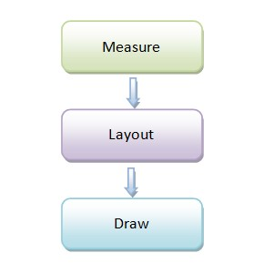

# Activity、Measure、Layout、Draw 分析

原文:[Android应用程序窗口（Activity）的测量（Measure）、布局（Layout）和绘制（Draw）过程分析][1]

Android应用程序窗口的UI渲染过程可以分为测量、布局和绘制三个阶段 
 
<a href="./app/src/main/java/com/mcablylx/mckiera/view/LookViewOverwrite.java">LookViewOverwrite.java</a>

----------
[1]:http://blog.csdn.net/luoshengyang/article/details/8372924